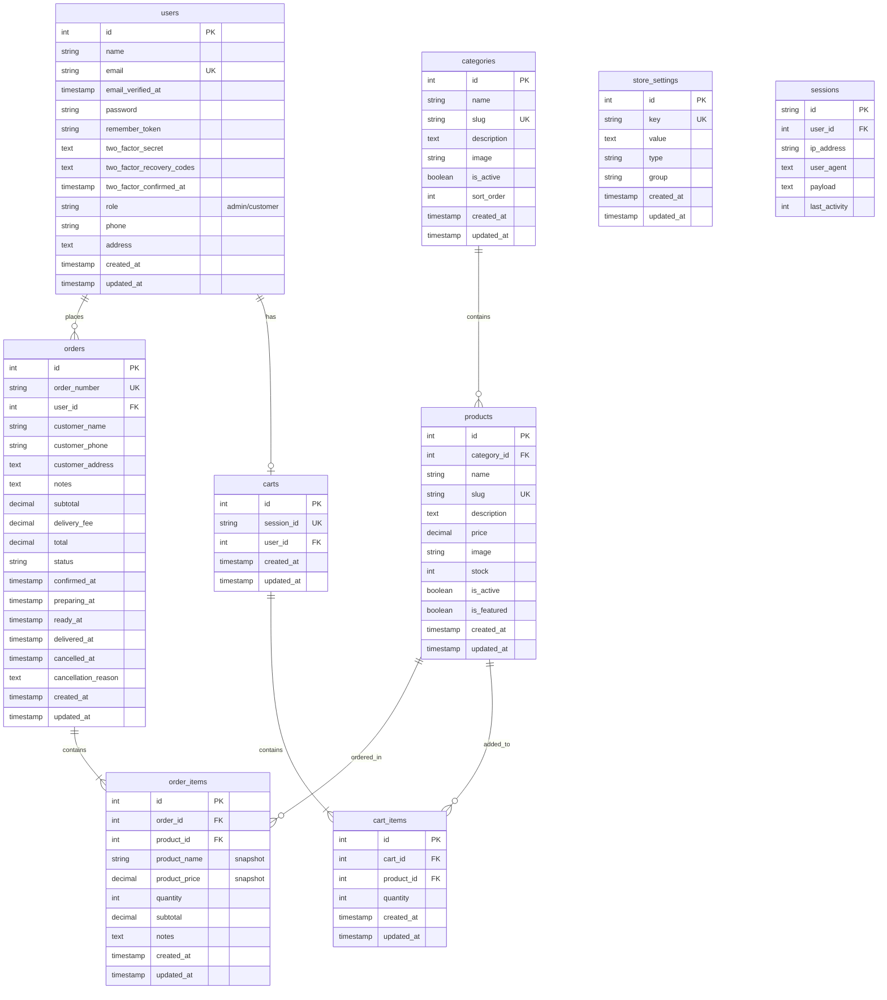
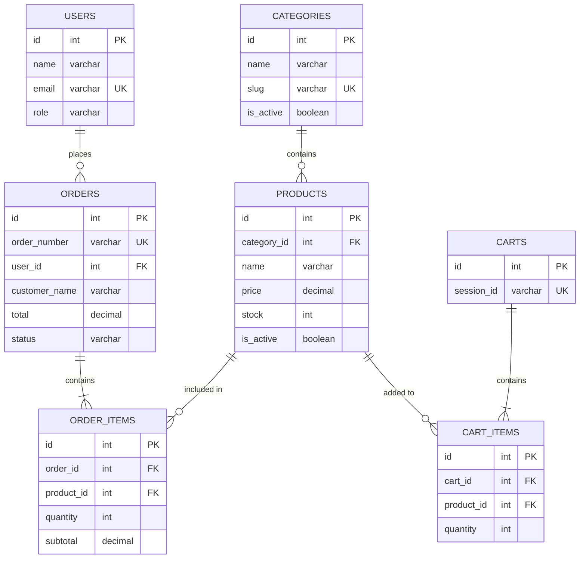
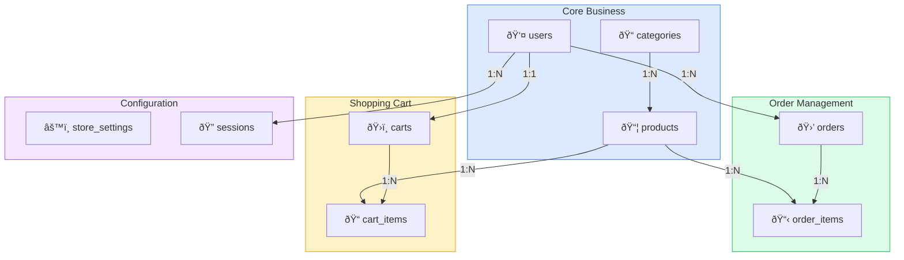

# Database Entity Relationship Diagram

**Penulis**: Zulfikar Hidayatullah

## Complete ERD

```mermaid
erDiagram
    users ||--o{ orders : "places"
    users ||--o| carts : "has"
    categories ||--o{ products : "contains"
    products ||--o{ order_items : "ordered_in"
    products ||--o{ cart_items : "added_to"
    orders ||--|{ order_items : "contains"
    carts ||--|{ cart_items : "contains"

    users {
        int id PK
        string name
        string email UK
        timestamp email_verified_at
        string password
        string remember_token
        text two_factor_secret
        text two_factor_recovery_codes
        timestamp two_factor_confirmed_at
        string role "admin/customer"
        string phone
        text address
        timestamp created_at
        timestamp updated_at
    }

    categories {
        int id PK
        string name
        string slug UK
        text description
        string image
        boolean is_active
        int sort_order
        timestamp created_at
        timestamp updated_at
    }

    products {
        int id PK
        int category_id FK
        string name
        string slug UK
        text description
        decimal price
        string image
        int stock
        boolean is_active
        boolean is_featured
        timestamp created_at
        timestamp updated_at
    }

    orders {
        int id PK
        string order_number UK
        int user_id FK
        string customer_name
        string customer_phone
        text customer_address
        text notes
        decimal subtotal
        decimal delivery_fee
        decimal total
        string status
        timestamp confirmed_at
        timestamp preparing_at
        timestamp ready_at
        timestamp delivered_at
        timestamp cancelled_at
        text cancellation_reason
        timestamp created_at
        timestamp updated_at
    }

    order_items {
        int id PK
        int order_id FK
        int product_id FK
        string product_name "snapshot"
        decimal product_price "snapshot"
        int quantity
        decimal subtotal
        text notes
        timestamp created_at
        timestamp updated_at
    }

    carts {
        int id PK
        string session_id UK
        int user_id FK
        timestamp created_at
        timestamp updated_at
    }

    cart_items {
        int id PK
        int cart_id FK
        int product_id FK
        int quantity
        timestamp created_at
        timestamp updated_at
    }

    store_settings {
        int id PK
        string key UK
        text value
        string type
        string group
        timestamp created_at
        timestamp updated_at
    }

    sessions {
        string id PK
        int user_id FK
        string ip_address
        text user_agent
        text payload
        int last_activity
    }
```

## Simplified ERD (Core Tables)

```mermaid
erDiagram
    USERS ||--o{ ORDERS : places
    CATEGORIES ||--o{ PRODUCTS : contains
    PRODUCTS ||--o{ ORDER_ITEMS : "included in"
    ORDERS ||--|{ ORDER_ITEMS : contains
    CARTS ||--|{ CART_ITEMS : contains
    PRODUCTS ||--o{ CART_ITEMS : "added to"

    USERS {
        id int PK
        name varchar
        email varchar UK
        role varchar
    }

    CATEGORIES {
        id int PK
        name varchar
        slug varchar UK
        is_active boolean
    }

    PRODUCTS {
        id int PK
        category_id int FK
        name varchar
        price decimal
        stock int
        is_active boolean
    }

    ORDERS {
        id int PK
        order_number varchar UK
        user_id int FK
        customer_name varchar
        total decimal
        status varchar
    }

    ORDER_ITEMS {
        id int PK
        order_id int FK
        product_id int FK
        quantity int
        subtotal decimal
    }

    CARTS {
        id int PK
        session_id varchar UK
    }

    CART_ITEMS {
        id int PK
        cart_id int FK
        product_id int FK
        quantity int
    }
```

## Table Relationships

```mermaid
flowchart TB
    subgraph Core["Core Business"]
        Users["👤 users"]
        Categories["📠categories"]
        Products["📦 products"]
    end

    subgraph Orders["Order Management"]
        OrdersT["🛒 orders"]
        OrderItems["📋 order_items"]
    end

    subgraph Cart["Shopping Cart"]
        Carts["ðŸ›ï¸ carts"]
        CartItems["📠cart_items"]
    end

    subgraph Config["Configuration"]
        Settings["âš™ï¸ store_settings"]
        Sessions["🔠sessions"]
    end

    Users -->|"1:N"| OrdersT
    Users -->|"1:1"| Carts
    Users -->|"1:N"| Sessions
    Categories -->|"1:N"| Products
    Products -->|"1:N"| OrderItems
    Products -->|"1:N"| CartItems
    OrdersT -->|"1:N"| OrderItems
    Carts -->|"1:N"| CartItems

    style Core fill:#dbeafe,stroke:#3b82f6
    style Orders fill:#dcfce7,stroke:#22c55e
    style Cart fill:#fef3c7,stroke:#f59e0b
    style Config fill:#f3e8ff,stroke:#a855f7
```

