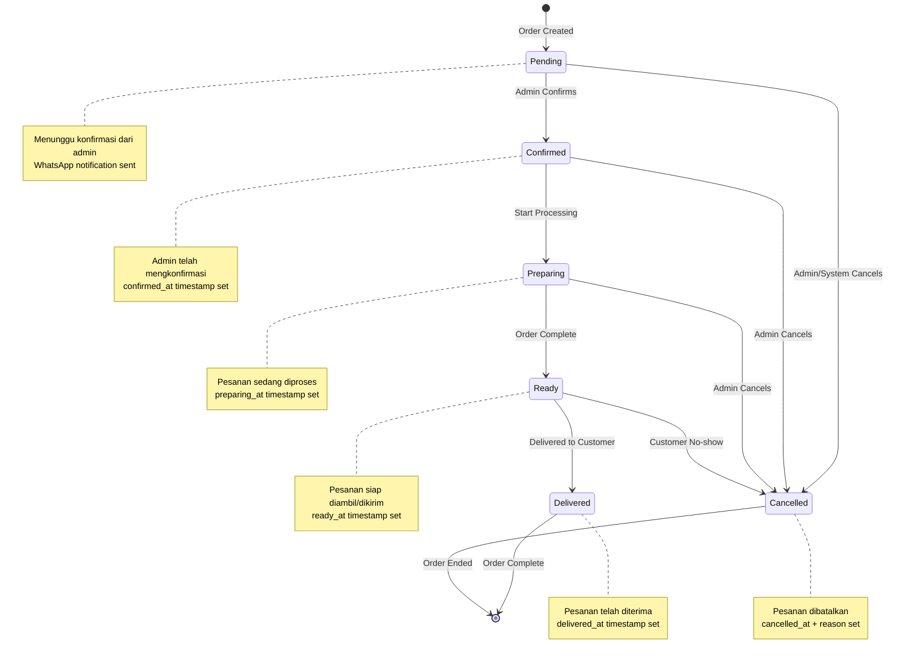
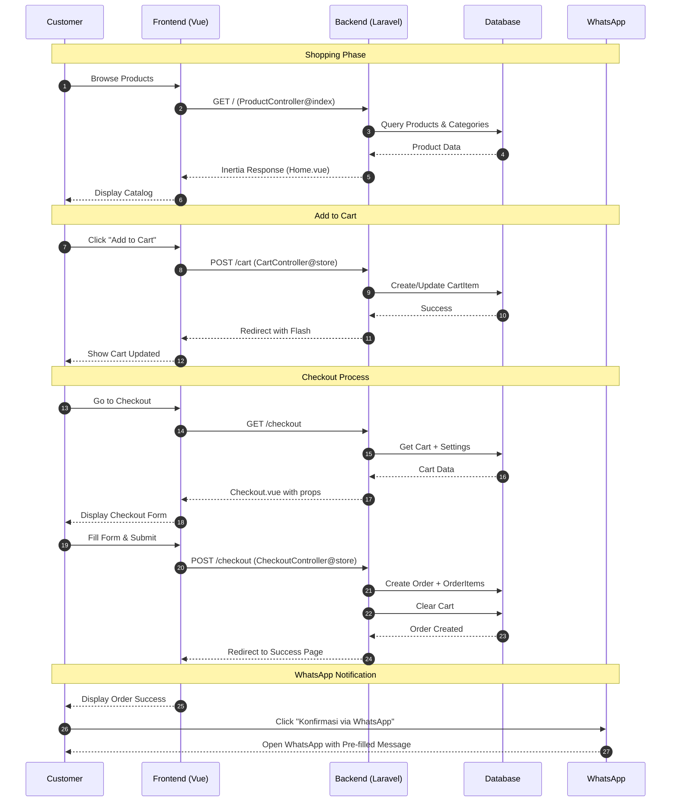
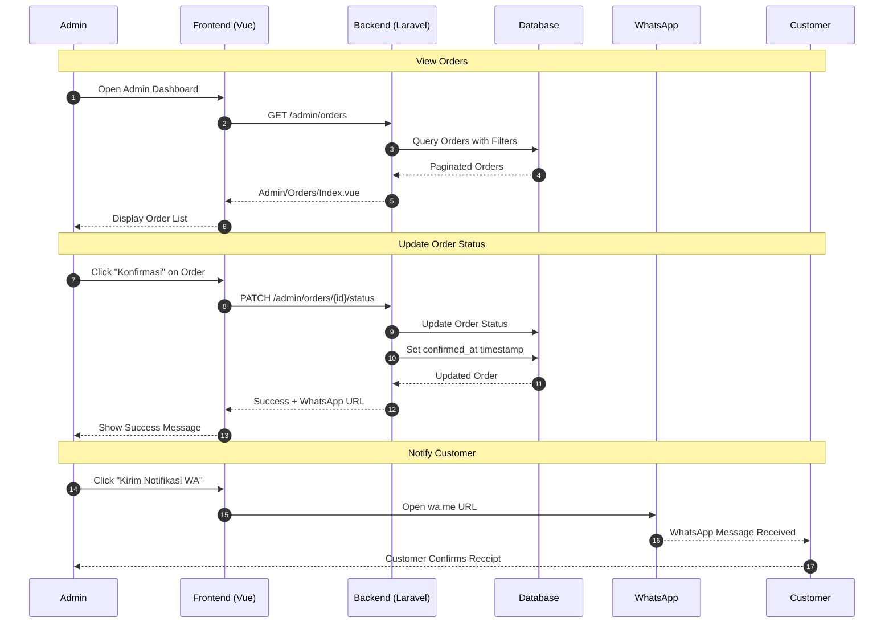
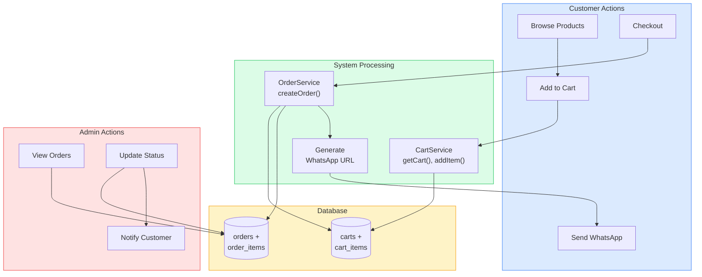

# Order Flow Diagrams

**Penulis**: Zulfikar Hidayatullah

## Order Status State Machine

## Customer Checkout Flow

## Admin Order Management Flow

## Order Processing Timeline

```mermaid
gantt
    title Order Lifecycle Timeline
    dateFormat HH:mm
    axisFormat %H:%M

    section Customer
    Browse Products           :c1, 09:00, 15m
    Add to Cart              :c2, after c1, 5m
    Checkout                 :c3, after c2, 10m
    Send WhatsApp            :c4, after c3, 2m
    
    section Admin
    Receive Notification     :a1, after c4, 1m
    Confirm Order            :a2, after a1, 2m
    Process Order            :a3, after a2, 30m
    Mark Ready               :a4, after a3, 2m
    
    section Delivery
    Deliver to Customer      :d1, after a4, 20m
    Mark Delivered           :d2, after d1, 1m
```

## Order Data Flow

