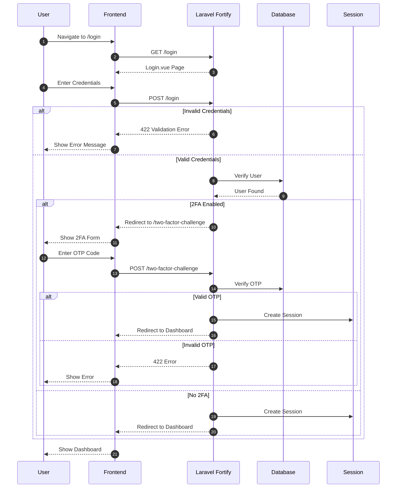
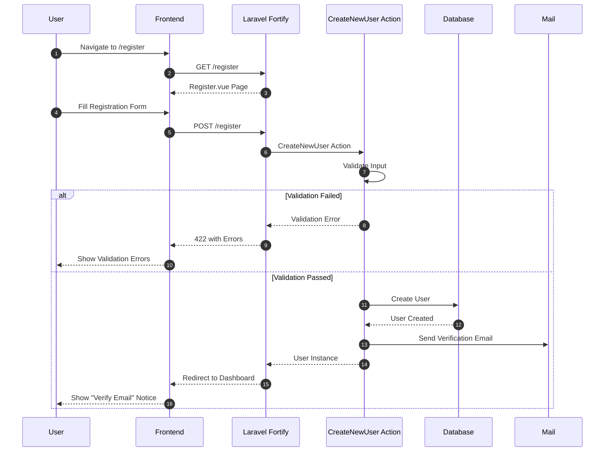
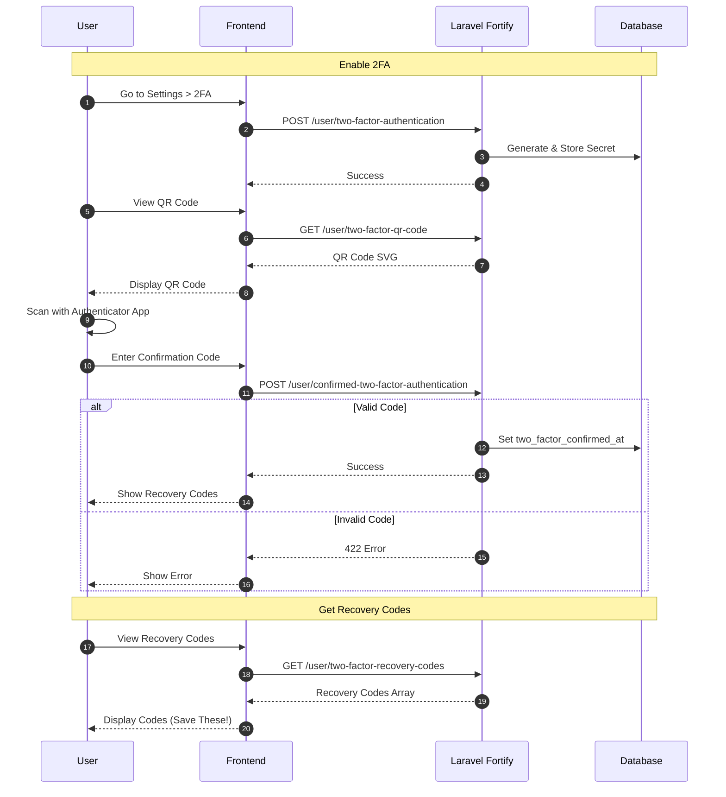
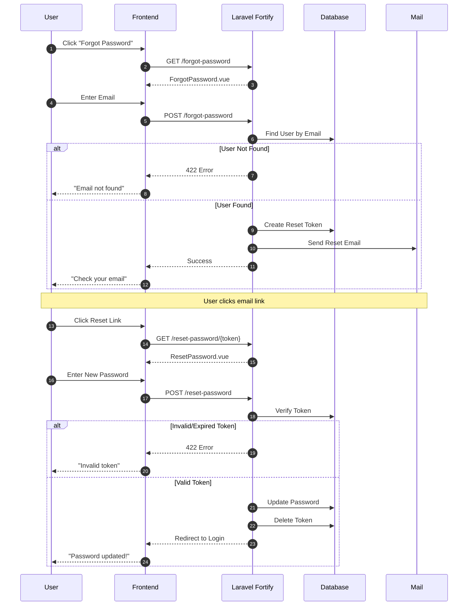
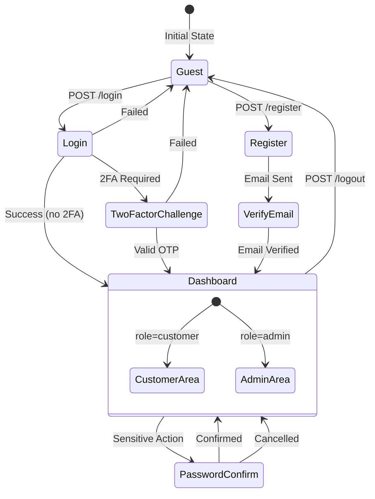
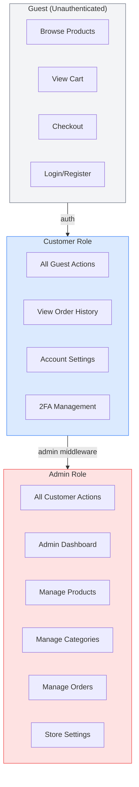
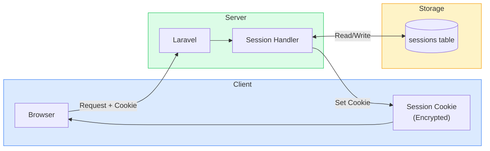

# Authentication Flow Diagrams

**Penulis**: Zulfikar Hidayatullah

## Login Flow

## Registration Flow

## Two-Factor Authentication Setup

## Password Reset Flow

## Authentication State Diagram

## Role-Based Access Control

## Session Management

