# Deployment Architecture Diagrams

**Penulis**: Zulfikar Hidayatullah

## Production Deployment Architecture

```mermaid
flowchart TB
    subgraph Internet["🌐 Internet"]
        Users["Users/Customers"]
        Admin["Admin"]
    end

    subgraph CDN["CDN (Optional)"]
        CloudFlare["CloudFlare/AWS CloudFront"]
    end

    subgraph Server["🖥️ Production Server"]
        subgraph WebServer["Web Server"]
            Nginx["Nginx<br/>:443 (HTTPS)"]
        end
        
        subgraph App["Application"]
            PHP["PHP-FPM 8.4"]
            Laravel["Laravel 12"]
            Queue["Queue Worker"]
        end
        
        subgraph Storage["Storage"]
            SQLite[("SQLite<br/>Database")]
            Files["File Storage<br/>(uploads)"]
            Logs["Logs"]
            Cache["Cache"]
        end
    end

    subgraph SSL["SSL/TLS"]
        LetsEncrypt["Let's Encrypt<br/>Certificate"]
    end

    subgraph External["External Services"]
        WhatsApp["WhatsApp API"]
        Mail["SMTP Server"]
    end

    Users --> CloudFlare
    Admin --> CloudFlare
    CloudFlare --> Nginx
    Nginx --> PHP
    PHP --> Laravel
    Laravel --> SQLite
    Laravel --> Files
    Laravel --> Cache
    Laravel --> Logs
    Laravel --> Queue
    Queue --> Mail
    Laravel --> WhatsApp
    Nginx -.-> LetsEncrypt

    style Internet fill:#e0f2fe,stroke:#0284c7
    style Server fill:#f0fdf4,stroke:#16a34a
    style External fill:#fce7f3,stroke:#db2777
```

## Docker Deployment Architecture

## Request Flow in Production

## CI/CD Pipeline

## Server Directory Structure

## Backup Strategy

## Monitoring Setup

