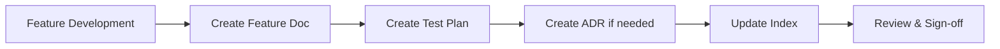

# Simple Store Documentation

Welcome to Simple Store documentation hub. Dokumen ini menyediakan comprehensive guide untuk understanding, developing, dan maintaining aplikasi.

---

## 📚 Documentation Structure

```
docs/
├── README.md (you are here)
├── features/           # Feature-specific documentation
│   └── security/       # Security-related features
├── adr/                # Architecture Decision Records
├── testing/            # Test plans dan QA documentation
├── api/                # API documentation (coming soon)
├── architecture/       # System architecture docs (coming soon)
└── guides/             # How-to guides (coming soon)
```

---

## 🔐 Security Documentation

### Latest: OWASP Security Hardening (SEC-001)

**Status:** ✅ Complete | **Date:** 2025-12-22 | **Priority:** Critical

Comprehensive security fixes addressing 12 vulnerabilities dari OWASP audit, mencakup:
- IDOR prevention (cart & orders)
- Rate limiting implementation
- Input sanitization (XSS & SQL injection)
- Session security
- Security headers

**📄 Documents:**
- [Feature Doc](./features/security/SEC-001-owasp-security-fixes.md) - Complete implementation guide
- [ADR-001](./adr/001-security-middleware-approach.md) - Security middleware decisions
- [ADR-002](./adr/002-rate-limiting-strategy.md) - Rate limiting strategy
- [Test Plan](./testing/SEC-001-test-plan.md) - QA dan testing documentation

**📊 Quick Stats:**
- **Fixes:** 12 vulnerabilities addressed
- **Test Coverage:** 20/20 security tests passing
- **Risk Level:** HIGH → LOW
- **Files Modified:** 15 files

---

## 🗂️ Quick Navigation

### By Role

| Role | Relevant Docs |
|------|---------------|
| **Developer** | Features, ADRs, Architecture |
| **QA/Tester** | Test Plans, API docs |
| **DevOps** | Deployment guides (TBD) |
| **Security** | Security features, ADRs |
| **Product Owner** | Feature docs, User journeys (TBD) |

### By Task

| Task | Documentation |
|------|---------------|
| Understanding security implementation | [SEC-001 Feature](./features/security/SEC-001-owasp-security-fixes.md) |
| Testing security features | [SEC-001 Test Plan](./testing/SEC-001-test-plan.md) |
| Understanding architecture decisions | [ADR Index](./adr/README.md) |
| API integration | [API Docs](./api/README.md) (TBD) |
| Setting up local environment | [Root README](../README.md) |

---

## 📋 Architecture Decision Records (ADRs)

ADRs document important architectural decisions dan rationale.

| ADR | Title | Status | Date |
|-----|-------|--------|------|
| [ADR-001](./adr/001-security-middleware-approach.md) | Security Middleware & Headers Implementation | Accepted | 2025-12-22 |
| [ADR-002](./adr/002-rate-limiting-strategy.md) | Rate Limiting Strategy & Implementation | Accepted | 2025-12-22 |

> 📌 **Note:** ADRs are immutable. Jika decision berubah, create new ADR yang supersede yang lama.

---

## 🎯 Feature Documentation Index

### Security Features

| Code | Feature | Priority | Status | Last Update |
|------|---------|----------|--------|-------------|
| SEC-001 | OWASP Security Hardening | Critical | ✅ Complete | 2025-12-22 |

### Coming Soon

| Category | Status |
|----------|--------|
| User Management Features | 📝 Planned |
| Cart & Checkout Features | 📝 Planned |
| Order Management Features | 📝 Planned |
| Admin Panel Features | 📝 Planned |

---

## 🧪 Testing Documentation

| Test Plan | Feature | Coverage | Status |
|-----------|---------|----------|--------|
| [SEC-001](./testing/SEC-001-test-plan.md) | Security Fixes | 20 tests | ✅ 100% Pass |

---

## 🏗️ Architecture Documentation

> 📌 **Coming Soon:**
> - System Architecture Overview
> - Data Flow Documentation
> - Database Schema Documentation
> - Integration Patterns

---

## 📖 API Documentation

> 📌 **Coming Soon:**
> - Cart API
> - Checkout API
> - Order API
> - Product API
> - Authentication API

---

## 📚 Guides

> 📌 **Coming Soon:**
> - Local Development Setup
> - Deployment Guide
> - Debugging Guide
> - Troubleshooting Guide
> - Contributing Guidelines

---

## 🔄 Documentation Standards

Setiap feature documentation mengikuti struktur standard:

### Required Sections
- Overview
- Business Requirements (User Stories)
- Technical Implementation
- Routes Summary
- Edge Cases
- Testing
- Security Considerations
- Related Documentation

### File Naming Convention
```
[CODE]-[feature-name].md

Examples:
- SEC-001-owasp-security-fixes.md
- OE15-equipment-management.md
- UF05-equipment-rental.md
```

### Document Lifecycle



---

## 📊 Documentation Health

| Metric | Status |
|--------|--------|
| Feature docs created | 1 |
| ADRs documented | 2 |
| Test plans completed | 1 |
| Documentation coverage | ~30% (early stage) |
| Last update | 2025-12-22 |

**Target:** 80% coverage by Q1 2026

---

## 🆘 Need Help?

### Documentation Issues
- Missing documentation? Create issue dengan label `documentation`
- Found outdated docs? Create issue dengan label `docs-update`
- Unclear documentation? Create issue dengan label `docs-improvement`

### Getting Started
1. Start dengan [Project README](../README.md) untuk setup
2. Read relevant feature docs untuk your task
3. Check ADRs untuk understanding decisions
4. Refer test plans untuk validation

---

## 📞 Contact

**Documentation Owner:** Zulfikar Hidayatullah  
**Email:** (contact info)  
**Last Review:** 2025-12-22  
**Next Review:** 2026-01-22

---

## 📝 Changelog

| Date | Changes | Author |
|------|---------|--------|
| 2025-12-22 | Initial documentation structure created | Zulfikar Hidayatullah |
| 2025-12-22 | Added SEC-001 security documentation | Zulfikar Hidayatullah |
| 2025-12-22 | Added ADR-001 dan ADR-002 | Zulfikar Hidayatullah |
| 2025-12-22 | Added SEC-001 test plan | Zulfikar Hidayatullah |

---

*This documentation follows principles from [The Documentation System](https://documentation.divio.com/) dan internal documentation guide.*

