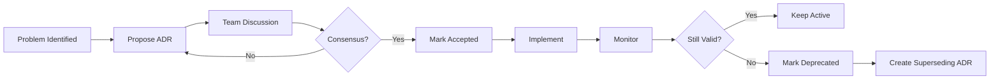

# Architecture Decision Records (ADR)

## Overview

Architecture Decision Records (ADRs) merupakan dokumentasi dari keputusan arsitektur yang significant, yaitu: mencatat context, decision, alternatives considered, dan consequences untuk membantu future developers memahami "why" behind architectural choices.

---

## ADR Index

| ADR | Title | Status | Date | Author |
|-----|-------|--------|------|--------|
| [001](./001-security-middleware-approach.md) | Security Middleware & Headers Implementation | Accepted | 2025-12-22 | Zulfikar Hidayatullah |
| [002](./002-rate-limiting-strategy.md) | Rate Limiting Strategy & Implementation | Accepted | 2025-12-22 | Zulfikar Hidayatullah |

---

## ADR Status Definitions

| Status | Description |
|--------|-------------|
| **Proposed** | ADR draft, under discussion |
| **Accepted** | Decision approved dan implemented |
| **Deprecated** | No longer applicable tapi kept for history |
| **Superseded** | Replaced by newer ADR (link provided) |

---

## When to Create ADR?

Create ADR ketika making decisions yang:
- ✅ Affect system architecture
- ✅ Have significant consequences
- ✅ Involve trade-offs
- ✅ Could be questioned di masa depan
- ✅ Set precedents untuk future decisions

**Examples:**
- Choosing technology stack
- Authentication strategy
- Rate limiting approach
- Security implementation patterns
- Database design patterns
- API design standards

**Don't create ADR for:**
- ❌ Routine implementation details
- ❌ Minor library choices (easily reversible)
- ❌ Temporary workarounds
- ❌ Obvious best practices

---

## ADR Template

```markdown
# ADR-XXX: [Title]

## Status

[Proposed | Accepted | Deprecated | Superseded by ADR-XXX]

## Date

[YYYY-MM-DD]

## Context

[Jelaskan situasi dan masalah yang dihadapi. Apa yang memicu
kebutuhan untuk membuat keputusan ini?]

## Decision

[Jelaskan keputusan yang diambil dengan jelas dan konkret.]

## Alternatives Considered

### Alternative 1: [Name]
- **Pros**: [kelebihan]
- **Cons**: [kekurangan]
- **Why rejected**: [alasan tidak dipilih]

### Alternative 2: [Name]
- **Pros**: [kelebihan]
- **Cons**: [kekurangan]
- **Why rejected**: [alasan tidak dipilih]

## Consequences

### Positive
- [Dampak positif 1]
- [Dampak positif 2]

### Negative
- [Dampak negatif 1]
- [Dampak negatif 2]

### Risks
- [Risiko potensial dan mitigasinya]

## References

- [Link ke resource relevan]
- [Link ke discussion/ticket]

---

**Author**: [Name]  
**Date**: [YYYY-MM-DD]  
**Status**: [Status]
```

---

## ADR Numbering

ADRs numbered sequentially starting from 001:
- `001-security-middleware-approach.md`
- `002-rate-limiting-strategy.md`
- `003-next-decision.md`

**Format:** `XXX-kebab-case-title.md`

---

## ADR Lifecycle



---

## Important Rules

### 🚫 ADRs are IMMUTABLE

Once an ADR is **Accepted**, NEVER edit the decision section.

**If decision changes:**
1. Mark old ADR as "Superseded by ADR-XXX"
2. Create NEW ADR explaining why decision changed
3. Link between old dan new ADR

**Example:**
```markdown
# ADR-002: Rate Limiting Strategy

## Status

Superseded by ADR-015 on 2026-03-15

[Original content remains unchanged]

---

**Superseded by:** [ADR-015: Redis-based Distributed Rate Limiting](./015-redis-rate-limiting.md)
```

---

## ADR Review Process

### When ADR is Created
1. Author creates ADR with status "Proposed"
2. Share dengan team untuk discussion
3. Address concerns dan questions
4. Update ADR dengan final decisions
5. Mark as "Accepted" when approved

### Periodic Review
- **Frequency:** Quarterly
- **Focus:** Are decisions still valid?
- **Actions:** Mark as deprecated if no longer applicable

---

## ADR Best Practices

### DO ✅
- Be specific dan concrete
- Include context yang cukup
- List ALL alternatives considered
- Document consequences (positive AND negative)
- Link to relevant resources
- Write in clear, simple language
- Focus on "why" not just "what"

### DON'T ❌
- Make ADRs too long (aim untuk 1-2 pages)
- Skip alternatives section
- Edit accepted ADRs
- Write implementation details (put in feature docs)
- Use jargon tanpa explanation
- Make assumptions tanpa stating them

---

## Related Documentation

- [Documentation Guide](../README.md) - Main documentation index
- [Feature Documentation](../features/README.md) - Feature-specific docs
- [Test Plans](../testing/README.md) - Testing documentation

---

## References

- [Architecture Decision Records](https://adr.github.io/)
- [Documenting Architecture Decisions](https://cognitect.com/blog/2011/11/15/documenting-architecture-decisions)
- [ADR Tools](https://github.com/npryce/adr-tools)

---

*Last Updated: 2025-12-22 by Zulfikar Hidayatullah*

