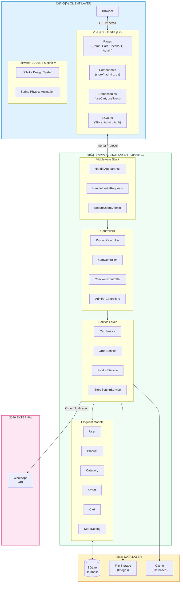
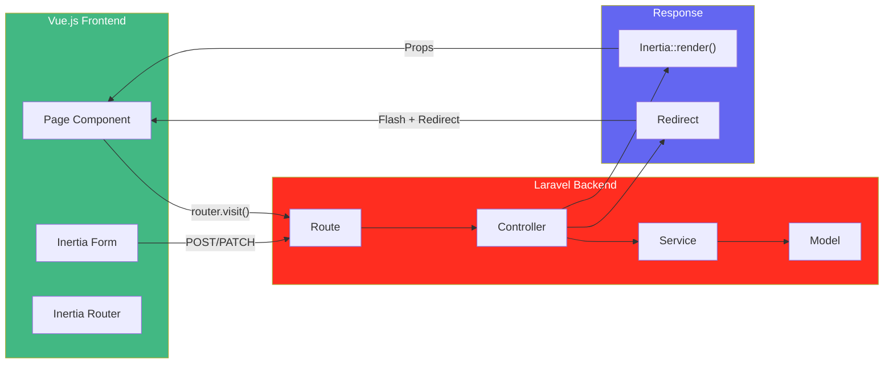
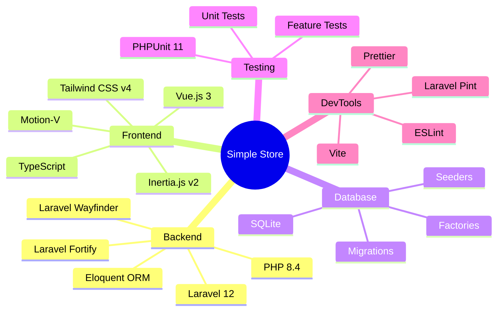

# System Architecture Diagram

**Penulis**: Zulfikar Hidayatullah

## High-Level Architecture

```mermaid
flowchart TB
    subgraph Client["🖥️ CLIENT LAYER"]
        direction TB
        Browser["Browser"]
        subgraph Frontend["Vue.js 3 + Inertia.js v2"]
            Pages["Pages<br/>(Home, Cart, Checkout, Admin)"]
            Components["Components<br/>(store/, admin/, ui/)"]
            Composables["Composables<br/>(useCart, useToast)"]
            Layouts["Layouts<br/>(Store, Admin, Auth)"]
        end
        subgraph Styling["Tailwind CSS v4 + Motion-V"]
            Theme["iOS-like Design System"]
            Animations["Spring Physics Animation"]
        end
    end

    subgraph Server["⚙️ APPLICATION LAYER - Laravel 12"]
        direction TB
        subgraph Middleware["Middleware Stack"]
            M1["HandleAppearance"]
            M2["HandleInertiaRequests"]
            M3["EnsureUserIsAdmin"]
        end
        
        subgraph Controllers["Controllers"]
            C1["ProductController"]
            C2["CartController"]
            C3["CheckoutController"]
            C4["Admin/*Controllers"]
        end
        
        subgraph Services["Service Layer"]
            S1["CartService"]
            S2["OrderService"]
            S3["ProductService"]
            S4["StoreSettingService"]
        end
        
        subgraph Models["Eloquent Models"]
            M_User["User"]
            M_Product["Product"]
            M_Category["Category"]
            M_Order["Order"]
            M_Cart["Cart"]
            M_Setting["StoreSetting"]
        end
    end

    subgraph Data["üíæ DATA LAYER"]
        direction LR
        SQLite[("SQLite<br/>Database")]
        Storage["File Storage<br/>(Images)"]
        Cache["Cache<br/>(File-based)"]
    end

    subgraph External["üåê EXTERNAL"]
        WhatsApp["WhatsApp<br/>API"]
    end

    Browser <-->|"HTTP/Inertia"| Frontend
    Frontend <-->|"Inertia Protocol"| Middleware
    Middleware --> Controllers
    Controllers --> Services
    Services --> Models
    Models <--> SQLite
    Services --> Storage
    Services --> Cache
    Services -->|"Order Notification"| WhatsApp

    style Client fill:#e0f2fe,stroke:#0284c7
    style Server fill:#f0fdf4,stroke:#16a34a
    style Data fill:#fef3c7,stroke:#d97706
    style External fill:#fce7f3,stroke:#db2777
```

## Component Interaction

```mermaid
flowchart LR
    subgraph Vue["Vue.js Frontend"]
        Page["Page Component"]
        Form["Inertia Form"]
        Router["Inertia Router"]
    end

    subgraph Laravel["Laravel Backend"]
        Route["Route"]
        Controller["Controller"]
        Service["Service"]
        Model["Model"]
    end

    subgraph Response["Response"]
        Inertia["Inertia::render()"]
        Redirect["Redirect"]
    end

    Page -->|"router.visit()"| Route
    Form -->|"POST/PATCH"| Route
    Route --> Controller
    Controller --> Service
    Service --> Model
    Controller --> Inertia
    Controller --> Redirect
    Inertia -->|"Props"| Page
    Redirect -->|"Flash + Redirect"| Page

    style Vue fill:#42b883,color:#fff
    style Laravel fill:#ff2d20,color:#fff
    style Response fill:#6366f1,color:#fff
```

## Tech Stack Overview

```mermaid
mindmap
    root((Simple Store))
        Backend
            Laravel 12
            PHP 8.4
            Eloquent ORM
            Laravel Fortify
            Laravel Wayfinder
        Frontend
            Vue.js 3
            Inertia.js v2
            Tailwind CSS v4
            Motion-V
            TypeScript
        Database
            SQLite
            Migrations
            Seeders
            Factories
        Testing
            PHPUnit 11
            Feature Tests
            Unit Tests
        DevTools
            Laravel Pint
            ESLint
            Prettier
            Vite
```

