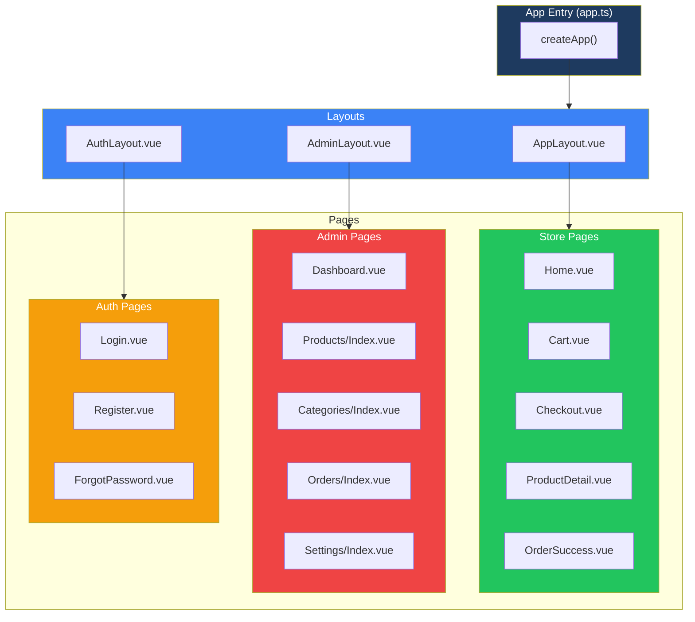
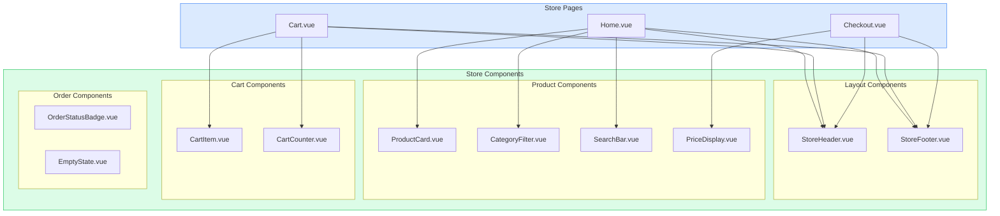
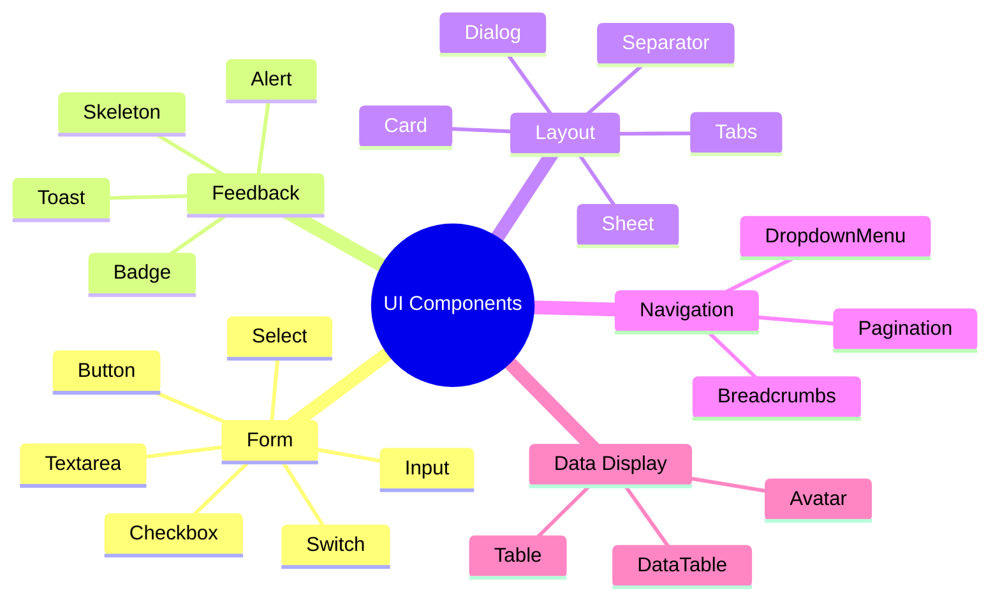
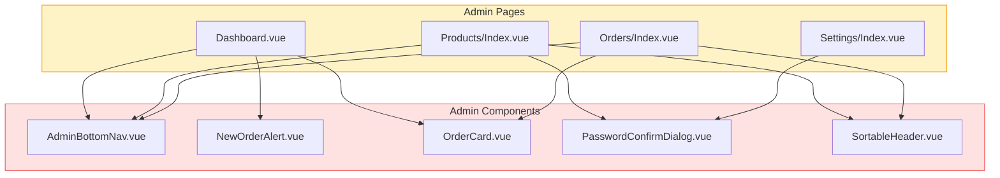
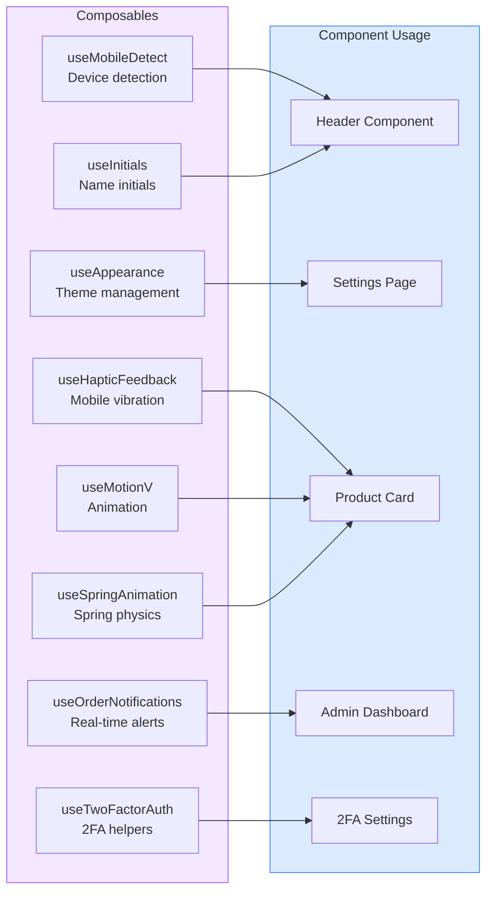
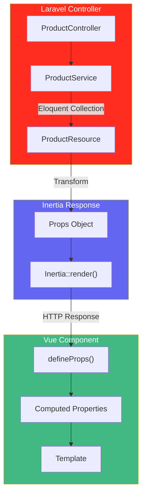
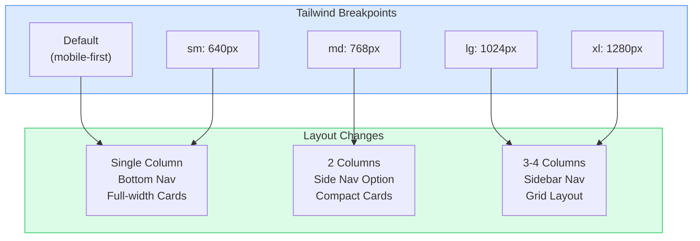
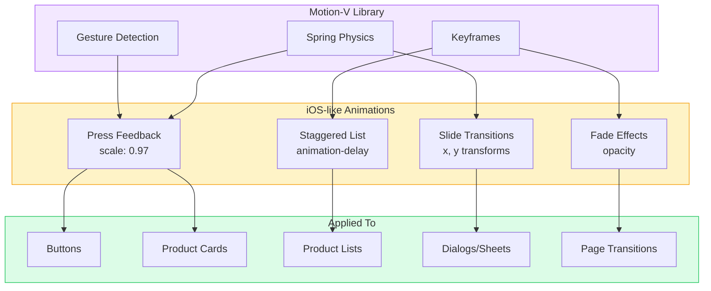

# Frontend Component Diagrams

**Penulis**: Zulfikar Hidayatullah

## Component Hierarchy

## Store Components Structure

## UI Component Library

## Admin Components Structure

## Composables (Hooks)

## Page Data Flow (Inertia Props)

## Mobile-First Responsive Design

## Animation System (Motion-V)

