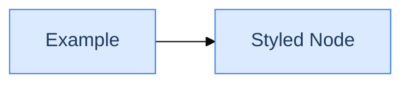

# Technical Diagrams

**Penulis**: Zulfikar Hidayatullah  
**Format**: Mermaid Diagrams

---

## Overview

Folder ini berisi diagram-diagram teknis untuk aplikasi Simple Store dalam format Mermaid. Diagram-diagram ini dapat di-render di berbagai platform yang mendukung Mermaid, antara lain:

- GitHub (native support)
- GitLab (native support)
- VS Code dengan extension "Mermaid Preview"
- Mermaid Live Editor (https://mermaid.live)
- Notion
- Obsidian

---

## Daftar Diagram

| File | Deskripsi |
|------|-----------|
| [01_system_architecture.md](01_system_architecture.md) | Arsitektur sistem, tech stack, dan component interaction |
| [02_database_erd.md](02_database_erd.md) | Entity Relationship Diagram database |
| [03_order_flow.md](03_order_flow.md) | Order status flow dan checkout sequence |
| [04_authentication_flow.md](04_authentication_flow.md) | Login, registration, 2FA, dan password reset |
| [05_deployment_architecture.md](05_deployment_architecture.md) | Production deployment dan CI/CD pipeline |
| [06_frontend_components.md](06_frontend_components.md) | Vue component hierarchy dan composables |

---

## Cara Menggunakan

### 1. GitHub / GitLab

File markdown dengan Mermaid akan otomatis di-render. Cukup buka file di browser.

### 2. VS Code

Install extension:
```
Name: Markdown Preview Mermaid Support
ID: bierner.markdown-mermaid
```

Kemudian buka file dan tekan `Ctrl+Shift+V` untuk preview.

### 3. Mermaid Live Editor

1. Buka https://mermaid.live
2. Copy kode Mermaid dari file
3. Paste di editor
4. Export sebagai PNG/SVG jika diperlukan

### 4. CLI Export

```bash
# Install mermaid-cli
npm install -g @mermaid-js/mermaid-cli

# Export to PNG
mmdc -i 01_system_architecture.md -o system_architecture.png

# Export to SVG
mmdc -i 02_database_erd.md -o database_erd.svg
```

---

## Diagram Types Used

| Type | Syntax | Digunakan Untuk |
|------|--------|-----------------|
| `flowchart` | `flowchart TB/LR` | Architecture, data flow |
| `sequenceDiagram` | `sequenceDiagram` | Request/response flow |
| `erDiagram` | `erDiagram` | Database relationships |
| `stateDiagram-v2` | `stateDiagram-v2` | State machines (order status) |
| `mindmap` | `mindmap` | Tech stack overview |
| `gantt` | `gantt` | Timeline visualization |

---

## Styling

Diagram menggunakan Mermaid's built-in styling dengan custom colors:



### Color Palette

| Color | Hex | Usage |
|-------|-----|-------|
| Blue | `#dbeafe` | Frontend/Client |
| Green | `#dcfce7` | Backend/Server |
| Yellow | `#fef3c7` | Database/Storage |
| Red | `#fee2e2` | Admin/Warning |
| Purple | `#f3e8ff` | External/Services |

---

## Maintenance

Saat melakukan update pada arsitektur atau flow aplikasi:

1. Update diagram yang relevan
2. Pastikan consistency antar diagram
3. Test render di Mermaid Live Editor
4. Commit perubahan dengan deskripsi yang jelas

---

## Quick Reference

### Flowchart Directions

- `TB` - Top to Bottom
- `BT` - Bottom to Top
- `LR` - Left to Right
- `RL` - Right to Left

### Common Shapes

```
[Rectangle]
(Rounded)
{Diamond}
[(Database)]
((Circle))
>Flag]
```

### Arrows

```
-->   Solid arrow
-.->  Dotted arrow
==>   Thick arrow
--text-->  Arrow with text
```

---

## Related Documentation

- [../01_System_Architecture.md](../01_System_Architecture.md)
- [../02_Database_Schema.md](../02_Database_Schema.md)
- [../03_API_Documentation.md](../03_API_Documentation.md)

